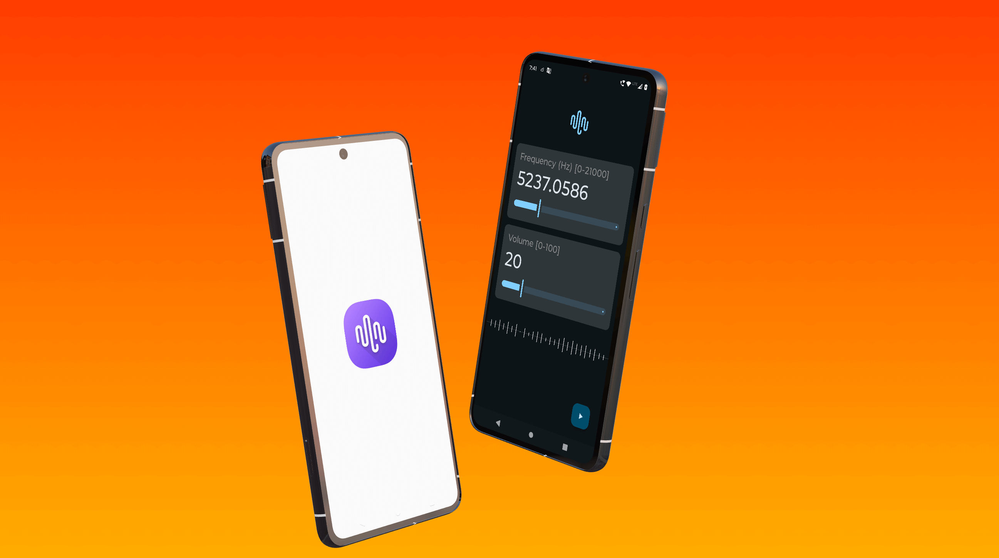

    

  

Easily generate audio tone of a specific frequency and volume in Android.

## Checkout

- 📜 [Changelog](docs/changelog.md)
- 🤝 [Integration docs](docs/integration.md)
- 💡 [Usage docs](docs/usage.md)
- 💻 [Dev docs](/dev-docs.md)

## Screenshot of Sample App

## License

Licensed under the [Apache License, Version 2.0](/LICENSE).

Copyright 2016 Nishant Srivastava

## Logo

Credit: <a href="https://www.flaticon.com/free-icons/audio" title="audio icons">Audio icons created
by Freepik - Flaticon</a>
